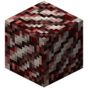
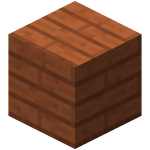
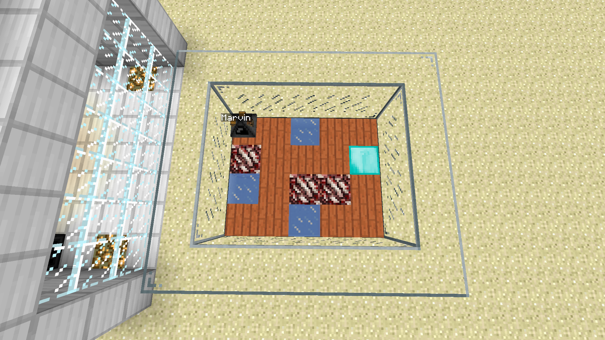
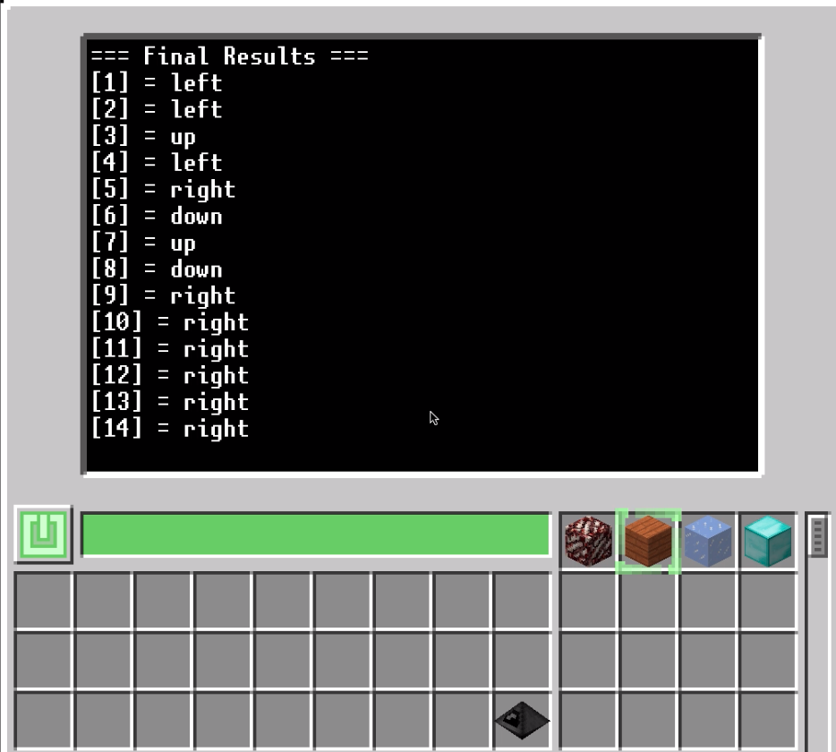
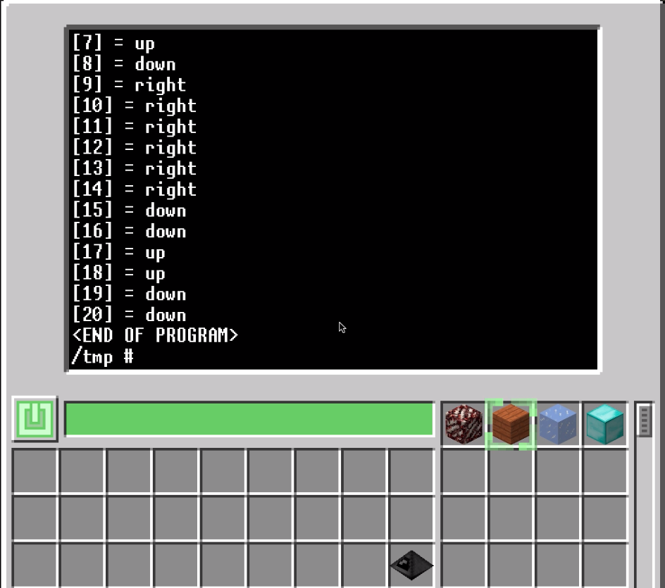

# CSE 150A Homework 7 | Mini-Project  
Nicholas Smith  
March 13, 2020

## Overview
The purpose of this project to explore and analyze an application of Reinforced Learning in a popular computer game - <b>Minecraft</b>. Using a robot and a handful of Lua programs, I was able to both estimate transition probabilities using a custom built map and perform value iteration using those estimated transition probabilities in order to compute the most optimal policy. All of the code for this project was written in Lua and entirely created by myself; no other public programs were utilized (aside from the API libraries). This project was broken down into two main components:
 

<b>Estimating Transition Probabilities</b> - The robot was tasked with figuring out the transitions probabilities for each state by making a discrete amount of moves and computing the frequency (probability) for each move. In the estimation algorithm, the robot iterates over all states (20 total states on the map) and for each state does the following:
 
1. Attempt to move either up, down, left, or right 100 times and keeps track of which moves actually occurred. If the attempted move was up and the computed "actual" move was down, the total number of down moves increased by 1. These values were then all divided by 100 to compute an estimated probability
2. This list was then used to update the transition probabilities table, which is to be used in the value iteration algorithm
 

<b>Value Iteration</b> - Once the transition probabilities have been estimated, the robot is tasked with iterating over all states for some number of iterations, N, in order to compute the most optimal policy. At each state the list of values is updated with a new value.
 

## Reinforced Learning Application
In reinforced learning our goal is to compute the optimal policy to reach some goal in order to maximize reward. Using this idea, I envisioned a literal robot performing these same actions, but inside of a video game. The main difference between a standard search algorithm (i.e. DFS, BFS, etc.) and reinforced learning is that we have to iterate over all states during each loop of the algorithm until the solution converges. This means that our robot will need to visit every state for some N number of iterations, which means more computing power is required. As mentioned above, I will be applying the standard value iteration algorithm (using Bellman's equation for value updates at each state) in order to compute the optimal policy.
 

## Map Setup
I used 4 different Minecraft blocks: acacia wood planks, a diamond block, nether quartz ore, and an ice block. Each block has a different reward and transition probability associated with it such that certain blocks are more enticiing to land on than others. The diamond block is our "goal" block, with an associated reward of 1. Each nether quartz ore is our negative block and has a value of -1. This way our robot can learn to avoid those blocks in order to maximize reward. Here are the blocks and their names:

| Nether Quartz | Diamond Block | Ice Block | Acacia Planks |
| :--: | :--: | :--: | :--: |
|  |  |  |  |

||
|:--:|
|*Game Map*|
 

## Results
After running the algorithm for a single iteration, the results shown below were produced. In the future, I would like to run this for 50-100 iterations but considering that a single iteration of this (aside from estimating the probabilities) takes 3 minutes it'd take quite some time to finish. 
> Note: Down/Left/Up/Right is subjective to the robot's orientation; this was included in the algorithm calculations. For example, state 20 shows "down" but since the robot is facing downwards when at state 20 "down" actually means more up one block. This shows that the robot would ideally be moving towards the diamond block.
 

## References
This project would not have been possible without the the modpacks's API, which can be found here: https://ocdoc.cil.li/
 
Using this API, I could make functions to the robot, modem, (used in communication), and events (also used in communication).
> Note: In the beginning of this project I intended on communicating to the robot over the wireless in-game network and a modem for processing messages. I was able to get all of this functions and actually had the robot initializing itself (by communicating with the computer) before doing anything, but over time this functions became less useful. If I were to expand on this project in the future, I would incorporate the ability to control various robots by running a command from the computer that gets sent to all robots.