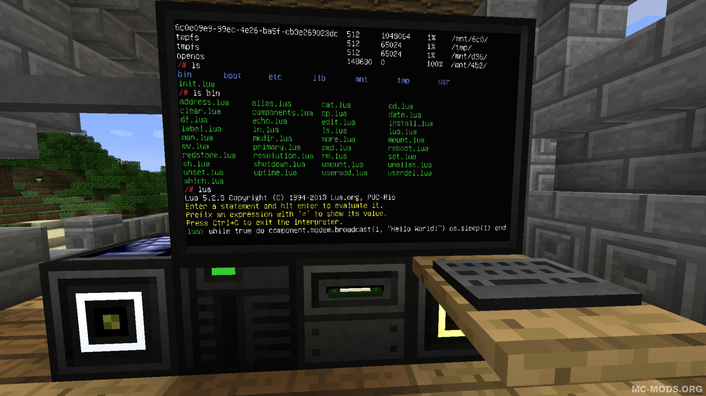

# CSE 150A Homework 7 | Mini-Project  
Nicholas Smith  
March 12, 2020

## Overview
The purpose of this project to explore and analyze an application of Reinforced Learning in a popular computer game - <b>Minecraft</b>. This project requires that the following "tools" be made available:

> Note: MC = Minecraft, RL = Real Life

1. Hardware - entities in the game that control how the game functions. 
    - EEPROM (MC): small storage device that can be flashed from a computer
    - HDD (MC): drive needed for the computer to operate
    - RAM (MC): needed for the computer to operate
    - Monitor (MC): needed to interact with the computer
    - Keyboard (MC): needed to interact with the computer
    - CPU (MC): needed for the computer to operate
    - Drone (MC): entity that can runs programs and move around the game
    - Computer Case (MC): needed to hold all of the computer parts
2. Software - code that will be required for this project
    - LUA BIOS (MC) - program (written in Lua) that allows the computer to boot up
    - OpenOS (MC) - operating system for the computer (mimics a shell environment)
    - Visual Studio Code (RL) - where programs are developed and then copied into a text file in-game
    - Text Editor (MC) - used in the game to develop solutions

## Reinforced Learning Application
In reinforced learning our goal is to compute the optimal policy to reach some goal in order to maximize reward. Using this idea, I envisioned a literal robot performing these same actions, but inside of a video game. The main difference between a standard search algorithm (i.e. DFS, BFS, etc.) and reinforced learning is that we have to iterate over all states during each loop of the algorithm until the solution converges. This means that our robot will need to visit every state for some N number of iterations, which means more computing power is required.  
To overcome this challenge, the robot's main purpose in this simulation will be to understandard the dynamics of its environment before computing the most optimal policy. For example, moving forward onto an ice block has a specific probability of resulting in the robot moving to the right, which is "unknown" to the robot. Therefore, it will have to emperically determine these values by traversing the custom built course and computing probabilities that will be stored in a dictionary, indexed by the type of block.  
<b>Example:</b> 

> { 
    'UP': { 
        'RIGHT': { 
            'SAND': 0.2, 
            'ICE': 0.9 
        }, 
        'LEFT': {
            'SAND': 0.1,
            'ICE': 0.05
        },
        'UP': {
            'SAND': 0.7,
            'ICE': 0.05
        }
    }
}  

Once the robot has determined its surroundings, it will apply the standard algorithm to compute the most optimal policy.  

## Getting Started
The details of getting this setup in Minecraft can be provided upon request, but I chose to exclude most of them for your own sanity. However, if you wish to know more about how I was able to set all of this up in a Minecraft mod feel free to ask.  
Here is the high-level view of how all of this works: 

#### Create computer --> Create drone --> Write program in Lua, flash to EEPROM of drone (small amount of storage, 4096 bytes) --> Drone executes program

## References
For this project I directly utilized two scripts from the internet - one is the computers BIOS code (similar to how real computer have a BIOS program that is called during initialization) and another for sending a Lua program over the in game network using a wireless card module that gets flashed to the drone's EEPROM memory. This essentially opens a modem for communication between the drone and computer which allows the user (me) to quickly update the drone's software.  

Both of these programs were created be a user named <i>Fingercomp</i> and can be found here: https://github.com/OpenPrograms/Fingercomp-Programs/tree/master/net-flash

As seen in the above list, all of the programs for this project will be programmed in Lua. Two of the programs used were taken directly from GitHub and are primarily meant to ease the process of debugging the drone and uploading new code. Please see the <i><b>REFERENCES</i></b> section at the bottom of the page to review these functions.